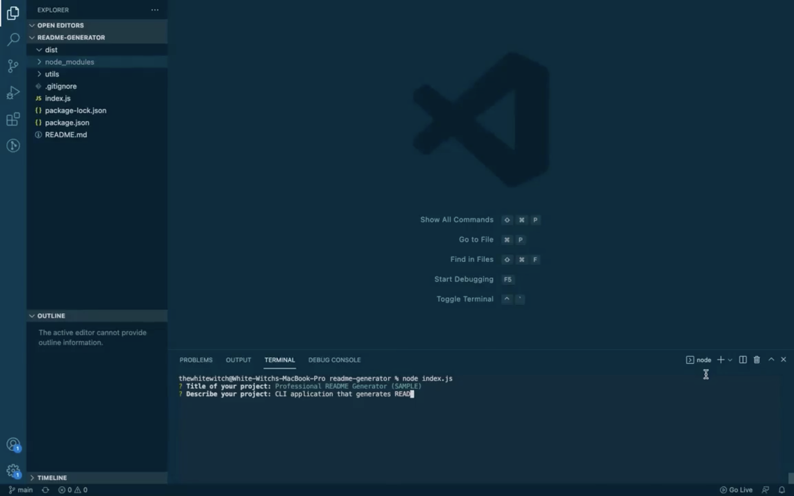

# README Generator
## Purpose
CLI application that prompts user for information to generate a README.md file
## Built With
- Markdown
- Node.js
- Inquirer.js
- Shield io
## Installation
To install this application, the following steps must be taken:
1. Install Node.js
2. Clone this repository
3. Access repository directory through terminal
4. Install Inquirer.js by typing the following into the terminal: 
```
npm install inquirer
```
## Usage
To use this application, the following steps must be taken:
1. From the repository directory, in the terminal, type the following:
```
node index.js
```
2. Answer the prompts
3. Access your newly created README.md in the 'dist' directory
## Walkthrough
Please click on the image to be redirected to a walkthrough video

[](https://drive.google.com/file/d/1PdAn-YMVR8pA01H3dYhTi717glbGTLWd/view?usp=sharing)
## Contribution
Created by CSM
